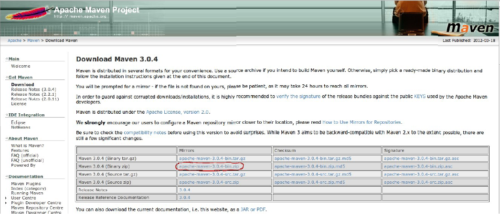
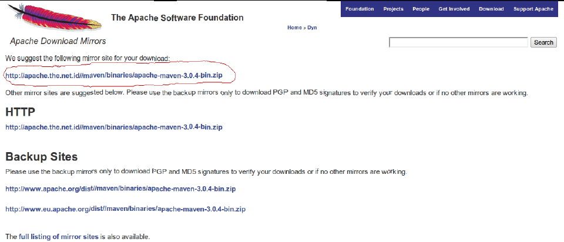
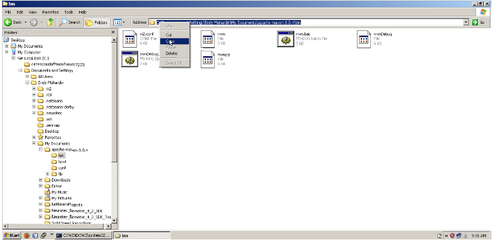
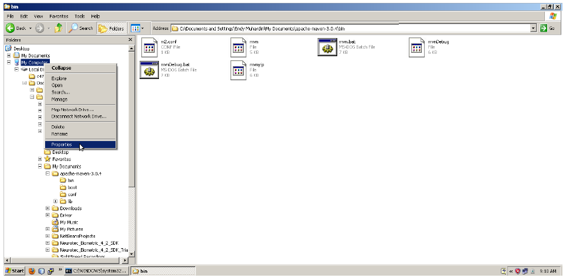
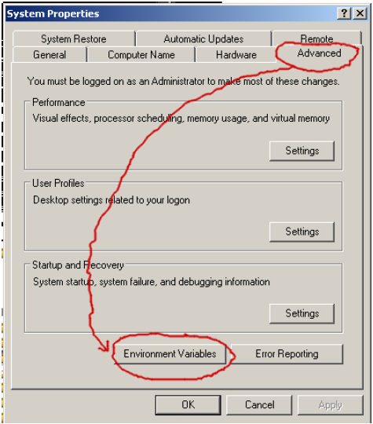
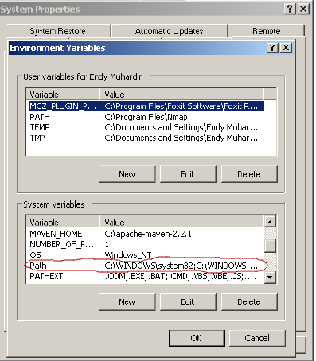
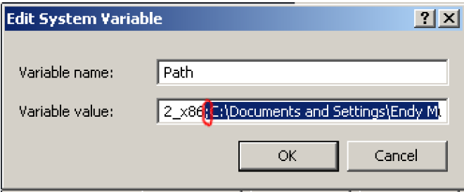
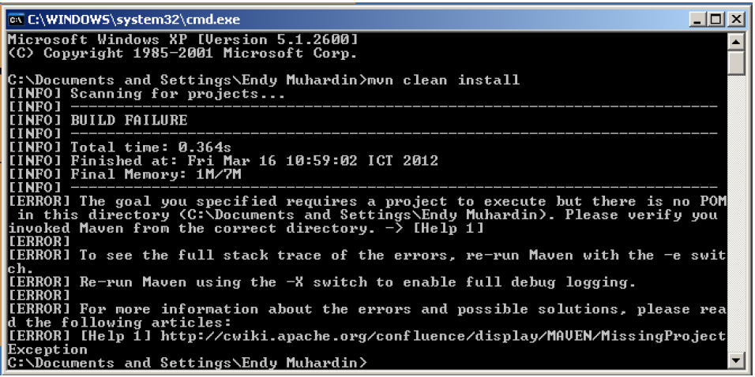
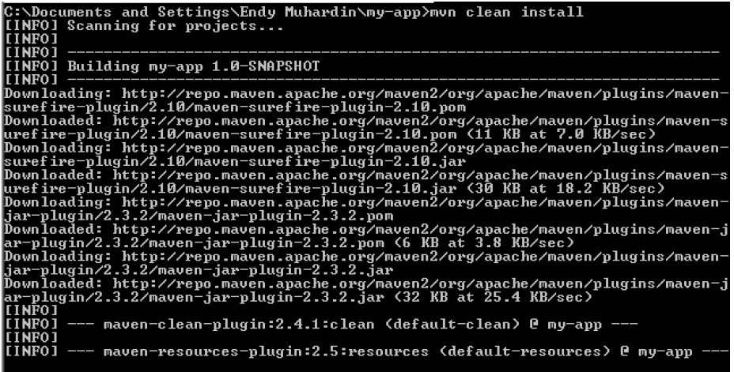
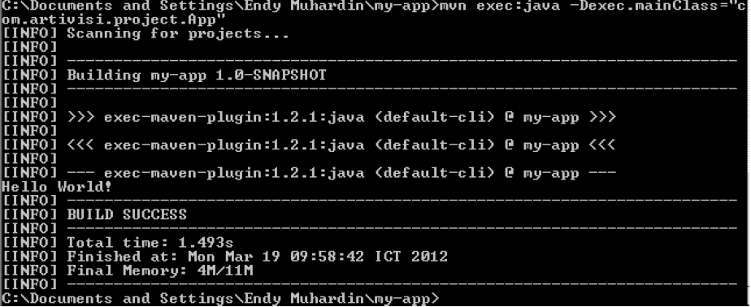

### Subject : ###
- Installasi Maven
- Build Tools

### Objective : ###
- Memahami Maven
- Memahami Build Tools

### Tugas Praktikum Sesi 1 ### 

## Latihan 1 : Installasi Maven ##

Langkah - Langkah Installasi Maven :
1. Langkah pertama adalah download maven terlebih dahulu disini :
[http://maven.apache.org/download.html](http://maven.apache.org/download.html) , download file `Maven 3.0.4
(Binary zip)` yang ada di kolom mirror => klik.



2. Setelah file `Maven 3.0.4 (Binary zip)` di klik, maka keluar browse untuk
mendownload file Maven 3.0.4 (Binary zip).

3. Setelah keluar browse untuk mendownload file Maven 3.0.4 (Binary zip),
lalu klik link : `http://apache.the.net.id//maven/binaries/apachemaven-
3.0.4-bin.zip` . Maka file `Maven 3.0.4 (Binary zip)` terdownload.



4. Setelah proses download selesai, selanjutnya extract file yang sudah anda
download.

5. Setelah file Maven di extract, lalu masuk ke folder maven hasil extract dan
masuk ke folder bin : \apache-maven-3.0.4\bin.

6. Setelah anda masuk folder bin, copy address bar ke dalam path dengan
cara :

- copy address bar, misalnya : `C:\Documents and Settings\EndyMuhardin\My Documents\apache-maven-3.0.4\bin`.



- Setelah address bar di copy, Klik kanan my computer => Properties =>
pilih tab Advanced => Klik Environment Variables (keluar lookup
Environment Variables) => Klik 2x `Path` yang ada pada kolom System
Variables (keluar lookup edit system variable).
	

	




- Edit variable value dengan cara tidak menghapus variable value yang ada,
lalu tambahkan tanda penghubung (;) titik koma pada baris paling
belakang, lalu paste address bar yang anda copy tadi di belakang (;).
	


- Setelah address bar sudah di copy pada `Path`, Lalu Klik OK (edit system
variable) => Klik OK (environment variables) => Klik OK (System
Properties) => Restart komputer anda.
	
7. Setelah komputer sudah hidup kembali, buka comand prompt, lalu ketik :
`mvn clean install` , jika berhasil akan keluar seperti dibawah ini :



8. Jika hasil seperti gambar di atas keluar, maka Installasi Maven selesai.

###  Latihan 2 : Build Tools (pembuatan project sederhana) ### 

1. Ketikkan perintah dibawah ini untuk membuat sebuah project dari
archetype :

```
mvn archetype:create -DgroupId=com.artivisi.project
-DartifactId=my-app
```

2. Jika berhasil akan muncul seperti di bawah ini :

``` cmd
C:\Documents and Settings\Endy Muhardin>mvn archetype:create
-DgroupId=com.artivisi.project -DartifactId=my-app
[INFO] Scanning for projects...
[INFO]
[INFO] ------------------------------------------------------------------------
[INFO] Building Maven Stub Project (No POM) 1
[INFO] ------------------------------------------------------------------------
[INFO]
[INFO] --- maven-archetype-plugin:2.1:create (default-cli) @ standalone-pom ---
[WARNING] This goal is deprecated. Please use mvn archetype:generate instead
[INFO] Defaulting package to group ID: com.artivisi.project
Downloading:
http://repo.maven.apache.org/maven2/org/apache/maven/archetypes/mav
en-archetype-quickstart/maven-metadata.xml
Downloaded: http://repo.maven.apache.org/maven2/org/apache/maven/archetypes/mavenarchetype-
quickstart/maven-metadata.xml (531 B at 0.2 KB/sec)
[INFO] ----------------------------------------------------------------------------
[INFO] Using following parameters for creating project from Old (1.x)
Archetype:maven-archetype quickstart:RELEASE
[INFO] ----------------------------------------------------------------------------
[INFO] Parameter: groupId, Value: com.artivisi.project
[INFO] Parameter: packageName, Value: com.artivisi.project
[INFO] Parameter: package, Value: com.artivisi.project
[INFO] Parameter: artifactId, Value: my-app
[INFO] Parameter: basedir, Value: C:\Documents and Settings\Endy Muhardin
[INFO] Parameter: version, Value: 1.0-SNAPSHOT
[INFO] project created from Old (1.x) Archetype in dir: C:\Documents and
Settings\Endy Muhardin\my-app
[INFO] ------------------------------------------------------------------------
[INFO] BUILD SUCCESS
[INFO] ------------------------------------------------------------------------
[INFO] Total time: 5.055s
[INFO] Finished at: Mon Mar 19 09:29:57 ICT 2012
[INFO] Final Memory: 7M/17M
[INFO] ------------------------------------------------------------------------
C:\Documents and Settings\Endy Muhardin>_
```

3. Jika tidak ada kesalahan, maka pada komputer akan terbuat sebuah
direktori dengan struktur seperti gambar dibawah ini :


4. Untuk menjalankannya, masuk ke direktori my-app dulu, dengan perintah
`cd my-app`.

5. lalu jalankan perintah seperti dibawah ini, untuk melakukan `mvn clean install`.

6. Jika berhasil akan muncul seperti di bawah ini :



7. Setelah proses clean install berhasil, selanjutnya ketik perintah di bawah ini :
```
mvn compile; mvn exec:java -Dexec.mainClass=com.artivisi.project.App
```

8. Jika berhasil, maka akan muncul seperti dibawah ini :




