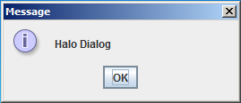
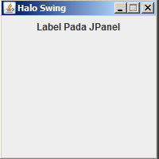

### Subject : Layout Manager ###
- Membuat Border Layout
- Membuat Grid Layout
- Membuat Flow Layout

### Objective : ###
- Memahami Cara Kerja Border Layout
- Memahami Cara Kerja Flow Layout
- Memahami Cara Kerja Grid Layout

### Catatan : ###
- Compiler maven membutuhkan koneksi internet untuk mendownload library-library maven..!!
- Tahap ini memerlukan instalasi `apache maven` , `jdk` dan setup `JAVA_HOME`.
	
### Tugas Praktikum Sesi 2 ###

### Latihan 1 : Membuat Border Layout ###

Langkah-Langkah Pembuatan :

1. Langkah pertama adalah membuat struktur folder sebagai berikut:


2. Buka cmd (Command Prompt) dan ketikkan perintah dibawah ini.

```
mvn archetype:create -DgroupId=com.artivisi.project -DartifactId=my-app
```

3. Buat file `HaloSwing.java` pada `src\main\java\com\artivisi\project`
dengan isi sebagai berikut.

```java
package com.artivisi.project;

import javax.swing.JFrame;
import javax.swing.JPanel;
import javax.swing.JOptionPane;
import javax.swing.JLabel;

public class HaloSwing {
	public static void main(String[] xx){
		JFrame fr = new JFrame();                               
		fr.setTitle("Halo Swing"); 		
		
		fr.setSize(200,200);
		fr.setLocationRelativeTo(null);
		fr.setDefaultCloseOperation(JFrame.EXIT_ON_CLOSE);
		
		fr.setResizable(false);
		
		JPanel pnl = new JPanel();
		JLabel lbl = new JLabel("Label Pada JPanel");
		pnl.add(lbl);
		fr.add(pnl);
		JOptionPane.showMessageDialog(null, "Halo Dialog");
		
		fr.setVisible(true);
		
	}
}
```

4. Jika sudah maka kita compile file `HaloSwing.java` dengan perintah dibawah ini 
dengan kondisi berada pada folder `my-app`.

```
mvn exec:java -Dexec.mainClass=com.artivisi.project.HaloSwing
```

5. Jika berhasil akan muncul seperti gambar berikut :



