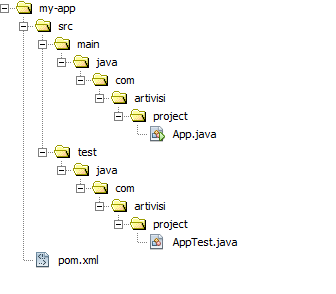
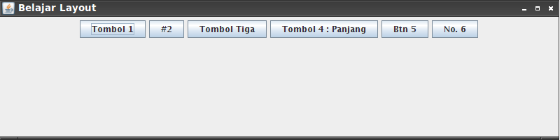
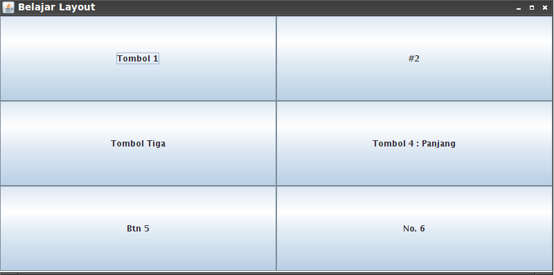
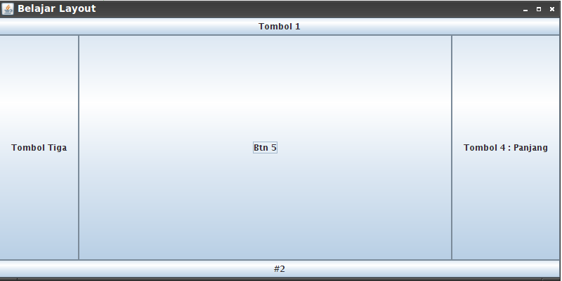

### Subject : Layout Manager ###
- Membuat Flow Layout
- Membuat Grid Layout
- Membuat Border Layout

### Objective : ###
- Memahami Cara Kerja Flow Layout
- Memahami Cara Kerja Grid Layout
- Memahami Cara Kerja Border Layout

### Catatan : ###
- Compiler maven membutuhkan koneksi internet untuk mendownload library-library maven..!!
- Tahap ini memerlukan instalasi `apache maven` , `jdk` dan setup `JAVA_HOME`.
	
### Tugas Praktikum Sesi 3 ###

### Latihan 1 : Membuat Flow Layout ###

Langkah-Langkah Pembuatan :

1. Langkah pertama adalah buka cmd (Command Prompt) dan ketikkan perintah dibawah ini.

``` cmd
mvn archetype:create -DgroupId=com.artivisi.project -DartifactId=my-app
```

2. Jika berhasil akan menghasilkan struktur folder seperti dibawah ini.



3. Ketikkan perintah dibawah ini pada command prompt.

``` cmd
mvn clean install
```

4. Jika instalasi ` apache maven ` , ` jdk ` dan setup ` JAVA_HOME ` telah benar maka akan tampil seperti dibawah ini :

```cmd

C:\my-app>mvn clean install
[INFO] Scanning for projects...
[INFO] ------------------------------------------------------------------------
[INFO] Building Unnamed - kuliah-pemrograman-3:belajar-menu:jar:1.0.0
[INFO]    task-segment: [clean, install]
[INFO] ------------------------------------------------------------------------
[INFO] [clean:clean {execution: default-clean}]
[INFO] Deleting file set: C:\my-app\target (included: [**], excluded: [])
[INFO] [resources:resources {execution: default-resources}]
[WARNING] Using platform encoding (UTF-8 actually) to copy filtered resources, i.e. build is platform dependent!
[INFO] skip non existing resourceDirectory C:\my-app\src\main\resources
[INFO] [compiler:compile {execution: default-compile}]
[INFO] Compiling 5 source files to C:\my-app\target\classes
[INFO] [resources:testResources {execution: default-testResources}]
[WARNING] Using platform encoding (UTF-8 actually) to copy filtered resources, i.e. build is platform dependent!
[INFO] skip non existing resourceDirectory C:\my-app\src\test\resources
[INFO] [compiler:testCompile {execution: default-testCompile}]
[INFO] No sources to compile
[INFO] [surefire:test {execution: default-test}]
[INFO] No tests to run.
[INFO] [jar:jar {execution: default-jar}]
[INFO] Building jar: C:\my-app\target\belajar-menu-1.0.0.jar
[INFO] [install:install {execution: default-install}]
[INFO] Installing C:\my-app\target\belajar-menu-1.0.0.jar to C:\Users\Ikin\.m2\repository\kuliah-pemrograman-3\belajar-menu\1.0.0\belajar-menu-1.0.0.jar
[INFO] ------------------------------------------------------------------------
[INFO] BUILD SUCCESSFUL
[INFO] ------------------------------------------------------------------------
[INFO] Total time: 3 seconds
[INFO] Finished at: Mon Oct 01 09:03:53 WIT 2012
[INFO] Final Memory: 15M\128M
[INFO] ------------------------------------------------------------------------

```

5. Buat file `DemoFlowLayout.java` pada `src\main\java\com\artivisi\project`
dengan isi sebagai berikut :

```java

package com.artivisi.project;

import javax.swing.*;
import java.awt.FlowLayout;

public class DemoFlowLayout {
    public static void main(String[] xx){
        // Beberapa button untuk demo
        JButton btn1 = new JButton("Tombol 1");
        JButton btn2 = new JButton("#2");
        JButton btn3 = new JButton("Tombol Tiga");
        JButton btn4 = new JButton("Tombol 4 : Panjang");
        JButton btn5 = new JButton("Btn 5");
        JButton btn6 = new JButton("No. 6");
        
        JPanel panel = new JPanel();
        panel.setLayout(new FlowLayout());
        panel.add(btn1);
        panel.add(btn2);
        panel.add(btn3);
        panel.add(btn4);
        panel.add(btn5);
        panel.add(btn6);
        
        // menginstankan Frame
        JFrame fr = new JFrame("Belajar Layout");
        
        fr.getContentPane().add(panel);
        // ukuran frame
        fr.setSize(800,200);
        
        // posisi di tengah
        fr.setLocationRelativeTo(null);
        
        // tampilkan
        fr.setVisible(true);
    }
}

```

4. Jika sudah maka kita compile dan jalankan file `DemoFlowLayout.java` dengan perintah berikut :

```cmd

mvn exec:java -Dexec.mainClass=com.artivisi.project.DemoFlowLayout

```

5. Jika berhasil akan muncul seperti gambar berikut :




### Latihan 2 : Membuat Grid Layout ###

Langkah-Langkah Pembuatan :

1. Buat file `DemoGridLayout.java` pada `src\main\java\com\artivisi\project`
dengan isi sebagai berikut :

```java

package com.artivisi.project;

import javax.swing.*;
import java.awt.GridLayout;

public class DemoGridLayout {
    public static void main(String[] xx){
        // Beberapa button untuk demo
        JButton btn1 = new JButton("Tombol 1");
        JButton btn2 = new JButton("#2");
        JButton btn3 = new JButton("Tombol Tiga");
        JButton btn4 = new JButton("Tombol 4 : Panjang");
        JButton btn5 = new JButton("Btn 5");
        JButton btn6 = new JButton("No. 6");
        
        JPanel panel = new JPanel();
        panel.setLayout(new GridLayout(3,2));
        panel.add(btn1);
        panel.add(btn2);
        panel.add(btn3);
        panel.add(btn4);
        panel.add(btn5);
        panel.add(btn6);
        
        // menginstankan Frame
        JFrame fr = new JFrame("Belajar Layout");
        
        fr.getContentPane().add(panel);
        // ukuran frame
        fr.setSize(800,400);
        
        // posisi di tengah
        fr.setLocationRelativeTo(null);
        
        // tampilkan
        fr.setVisible(true);
    }
}


```

2. Jika sudah maka kita clean package, compile dan jalankan file `DemoGridLayout.java` dengan perintah berikut :

```cmd

mvn clean package exec:java -Dexec.mainClass=com.artivisi.project.DemoGridLayout

```

3. Jika berhasil maka akan tampil seperti berikut :




### Latihan 3 : Membuat Border Layout ###

Langkah-Langkah Pembuatan :

1. Buat file `DemoBorderLayout.java` pada `src\main\java\com\artivisi\project`
dengan isi sebagai berikut :

```java

package com.artivisi.project;

import javax.swing.*;
import java.awt.BorderLayout;

public class DemoBorderLayout {
    public static void main(String[] xx){
        // Beberapa button untuk demo
        JButton btn1 = new JButton("Tombol 1");
        JButton btn2 = new JButton("#2");
        JButton btn3 = new JButton("Tombol Tiga");
        JButton btn4 = new JButton("Tombol 4 : Panjang");
        JButton btn5 = new JButton("Btn 5");
        JButton btn6 = new JButton("No. 6");
        
        JPanel panel = new JPanel();
        panel.setLayout(new BorderLayout());
        panel.add(btn1, BorderLayout.NORTH);
        panel.add(btn2, BorderLayout.SOUTH);
        panel.add(btn3, BorderLayout.WEST);
        panel.add(btn4, BorderLayout.EAST);
        panel.add(btn5, BorderLayout.CENTER);
        
        // tidak bisa add button 6, tempatnya cuma 5
        // panel.add(btn6);
        
        // menginstankan Frame
        JFrame fr = new JFrame("Belajar Layout");
        
        fr.getContentPane().add(panel);
        // ukuran frame
        fr.setSize(800,400);
        
        // posisi di tengah
        fr.setLocationRelativeTo(null);
        
        // tampilkan
        fr.setVisible(true);
    }
}

```

2. Jika sudah maka kita clean package, compile dan jalankan file `DemoBorderLayout.java` dengan perintah berikut :

```cmd

mvn clean package exec:java -Dexec.mainClass=com.artivisi.project.DemoBorderLayout

```

3. Jika berhasil maka akan tampil seperti berikut :



