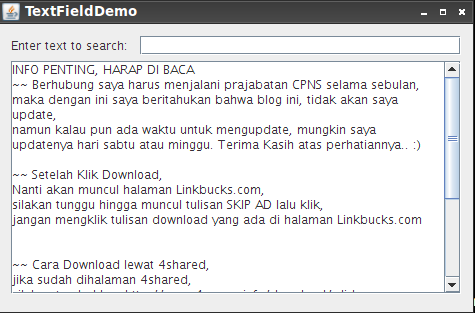
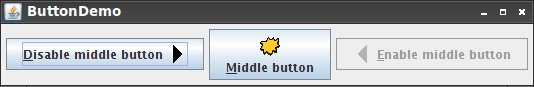
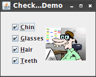
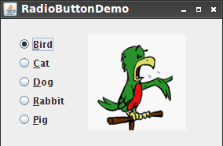

## Pemograman 3 Sesi 04 ##

### Simple Component ###

### Subject : ###

- Text Field
- Button
- Checkbox
- Radio Button

### Tugas 1 : Membuat Text Field ###

Langkah - Langkah :

* Buat Folder dengan nama `Sesi_04` .
* Masuk kedalam folder `Sesi_04` dan buat file baru dengan nama `content.txt` .
* Isikan artikel atau kata-kata yang membentuk suatu paragraf pada file `content.txt` lalu save. 
* Buat file baru dengan nama `TextFieldDemo.java` lalu ketikkan `Source Code` seperti dibawah ini dan save.

``` java
/*
 * TextFieldDemo.java requires one additional file:
 * content.txt
 */

import java.awt.Color;
import java.awt.event.ActionEvent;
import java.io.IOException;
import java.io.InputStream;
import java.io.InputStreamReader;
import javax.swing.*;
import javax.swing.text.*;
import javax.swing.event.*;
import javax.swing.GroupLayout.*;

public class TextFieldDemo extends JFrame
                           implements DocumentListener {
    
    private JTextField entry;
    private JLabel jLabel1;
    private JScrollPane jScrollPane1;
    private JLabel status;
    private JTextArea textArea;
    
    final static Color  HILIT_COLOR = Color.LIGHT_GRAY;
    final static Color  ERROR_COLOR = Color.PINK;
    final static String CANCEL_ACTION = "cancel-search";
    
    final Color entryBg;
    final Highlighter hilit;
    final Highlighter.HighlightPainter painter;
    
    
    public TextFieldDemo() {
        initComponents();
        
        InputStream in = getClass().getResourceAsStream("content.txt");
        try {
            textArea.read(new InputStreamReader(in), null);
        } catch (IOException e) {
            e.printStackTrace();
        }
        
        hilit = new DefaultHighlighter();
        painter = new DefaultHighlighter.DefaultHighlightPainter(HILIT_COLOR);
        textArea.setHighlighter(hilit);
        
        entryBg = entry.getBackground();
        entry.getDocument().addDocumentListener(this);
        
        InputMap im = entry.getInputMap(JComponent.WHEN_IN_FOCUSED_WINDOW);
        ActionMap am = entry.getActionMap();
        im.put(KeyStroke.getKeyStroke("ESCAPE"), CANCEL_ACTION);
        am.put(CANCEL_ACTION, new CancelAction());
    }
    
    /** This method is called from within the constructor to
     * initialize the form.
     */

    private void initComponents() {
        entry = new JTextField();
        textArea = new JTextArea();
        status = new JLabel();
        jLabel1 = new JLabel();

        setDefaultCloseOperation(WindowConstants.EXIT_ON_CLOSE);
        setTitle("TextFieldDemo");

        textArea.setColumns(20);
        textArea.setLineWrap(true);
        textArea.setRows(5);
        textArea.setWrapStyleWord(true);
        textArea.setEditable(false);
        jScrollPane1 = new JScrollPane(textArea);

        jLabel1.setText("Enter text to search:");

        GroupLayout layout = new GroupLayout(getContentPane());
        getContentPane().setLayout(layout);
        
	//Create a parallel group for the horizontal axis
	ParallelGroup hGroup = layout.createParallelGroup(GroupLayout.Alignment.LEADING);
	
	//Create a sequential and a parallel groups
	SequentialGroup h1 = layout.createSequentialGroup();
	ParallelGroup h2 = layout.createParallelGroup(GroupLayout.Alignment.TRAILING);
	
	//Add a container gap to the sequential group h1
	h1.addContainerGap();
	
	//Add a scroll pane and a label to the parallel group h2
	h2.addComponent(jScrollPane1, GroupLayout.Alignment.LEADING, GroupLayout.DEFAULT_SIZE, 450, Short.MAX_VALUE);
	h2.addComponent(status, GroupLayout.Alignment.LEADING, GroupLayout.DEFAULT_SIZE, 450, Short.MAX_VALUE);
	
	//Create a sequential group h3
	SequentialGroup h3 = layout.createSequentialGroup();
	h3.addComponent(jLabel1);
	h3.addPreferredGap(LayoutStyle.ComponentPlacement.RELATED);
	h3.addComponent(entry, GroupLayout.DEFAULT_SIZE, 321, Short.MAX_VALUE);
	 
	//Add the group h3 to the group h2
	h2.addGroup(h3);
	//Add the group h2 to the group h1
	h1.addGroup(h2);

	h1.addContainerGap();
	
	//Add the group h1 to the hGroup
	hGroup.addGroup(GroupLayout.Alignment.TRAILING, h1);
	//Create the horizontal group
	layout.setHorizontalGroup(hGroup);
	
        
	//Create a parallel group for the vertical axis
	ParallelGroup vGroup = layout.createParallelGroup(GroupLayout.Alignment.LEADING);
	//Create a sequential group v1
	SequentialGroup v1 = layout.createSequentialGroup();
	//Add a container gap to the sequential group v1
	v1.addContainerGap();
	//Create a parallel group v2
	ParallelGroup v2 = layout.createParallelGroup(GroupLayout.Alignment.BASELINE);
	v2.addComponent(jLabel1);
	v2.addComponent(entry, GroupLayout.PREFERRED_SIZE, GroupLayout.DEFAULT_SIZE, GroupLayout.PREFERRED_SIZE);
	//Add the group v2 tp the group v1
	v1.addGroup(v2);
	v1.addPreferredGap(javax.swing.LayoutStyle.ComponentPlacement.RELATED);
	v1.addComponent(jScrollPane1, GroupLayout.DEFAULT_SIZE, 233, Short.MAX_VALUE);
	v1.addPreferredGap(javax.swing.LayoutStyle.ComponentPlacement.RELATED);
	v1.addComponent(status);
	v1.addContainerGap();
	
	//Add the group v1 to the group vGroup
	vGroup.addGroup(v1);
	//Create the vertical group
	layout.setVerticalGroup(vGroup);
	pack();
    }

    public void search() {
        hilit.removeAllHighlights();
        
        String s = entry.getText();
        if (s.length() <= 0) {
            message("Nothing to search");
            return;
        }
        
        String content = textArea.getText();
        int index = content.indexOf(s, 0);
        if (index >= 0) {   // match found
            try {
                int end = index + s.length();
                hilit.addHighlight(index, end, painter);
                textArea.setCaretPosition(end);
                entry.setBackground(entryBg);
                message("'" + s + "' found. Press ESC to end search");
            } catch (BadLocationException e) {
                e.printStackTrace();
            }
        } else {
            entry.setBackground(ERROR_COLOR);
            message("'" + s + "' not found. Press ESC to start a new search");
        }
    }

    void message(String msg) {
        status.setText(msg);
    }

    // DocumentListener methods
    
    public void insertUpdate(DocumentEvent ev) {
        search();
    }
    
    public void removeUpdate(DocumentEvent ev) {
        search();
    }
    
    public void changedUpdate(DocumentEvent ev) {
    }
    
    class CancelAction extends AbstractAction {
        public void actionPerformed(ActionEvent ev) {
            hilit.removeAllHighlights();
            entry.setText("");
            entry.setBackground(entryBg);
        }
    }
    
    
    public static void main(String args[]) {
        //Schedule a job for the event dispatch thread:
        //creating and showing this application's GUI.
	SwingUtilities.invokeLater(new Runnable() {
            public void run() {
                //Turn off metal's use of bold fonts
                UIManager.put("swing.boldMetal", Boolean.FALSE);
		new TextFieldDemo().setVisible(true);
            }
        });
    }
    
   
}
```

* Jika sudah kita dapat mengcompile file `TextFieldDemo.java` dengan perintah berikut.

``` 
javac TextFieldDemo.java 
```

* Setelah berhasil compile kita jalankan dengan perintah `java TextFieldDemo` .

* Jika berhasil akan tampil seperti gambar dibawah ini.




### Tugas 2 : Membuat Button ###

Langkah - Langkah :

* Masih berada pada folder `Sesi_04` dan buat folder `images` dan kita download 3 buah image pada link berikut dan letakkan pada folder `images`.

1. [https://github.com/sholihin/Pemograman3/blob/master/Sesi_04/images/left.gif](https://github.com/sholihin/Pemograman3/blob/master/Sesi_04/images/left.gif)
2. [https://github.com/sholihin/Pemograman3/blob/master/Sesi_04/images/right.gif](https://github.com/sholihin/Pemograman3/blob/master/Sesi_04/images/right.gif)
3. [https://github.com/sholihin/Pemograman3/blob/master/Sesi_04/images/middle.gif](https://github.com/sholihin/Pemograman3/blob/master/Sesi_04/images/middle.gif)

* Lalu kembali pada folder `Sesi_04` dan buat file dengan nama `ButtonDemo.java` .
* Isikan `ButtonDemo.java` dengan `Source Code` dibawah ini.

``` java
import javax.swing.AbstractButton;
import javax.swing.JButton;
import javax.swing.JPanel;
import javax.swing.JFrame;
import javax.swing.ImageIcon;

import java.awt.event.ActionEvent;
import java.awt.event.ActionListener;
import java.awt.event.KeyEvent;

/* 
 * ButtonDemo.java requires the following files:
 *   images/right.gif
 *   images/middle.gif
 *   images/left.gif
 */
 
public class ButtonDemo extends JPanel
                        implements ActionListener {
    protected JButton b1, b2, b3;

    public ButtonDemo() {
        ImageIcon leftButtonIcon = createImageIcon("images/right.gif");
        ImageIcon middleButtonIcon = createImageIcon("images/middle.gif");
        ImageIcon rightButtonIcon = createImageIcon("images/left.gif");

        b1 = new JButton("Disable middle button", leftButtonIcon);
        b1.setVerticalTextPosition(AbstractButton.CENTER);
        b1.setHorizontalTextPosition(AbstractButton.LEADING); //aka LEFT, for left-to-right locales
        b1.setMnemonic(KeyEvent.VK_D);
        b1.setActionCommand("disable");

        b2 = new JButton("Middle button", middleButtonIcon);
        b2.setVerticalTextPosition(AbstractButton.BOTTOM);
        b2.setHorizontalTextPosition(AbstractButton.CENTER);
        b2.setMnemonic(KeyEvent.VK_M);

        b3 = new JButton("Enable middle button", rightButtonIcon);
        //Use the default text position of CENTER, TRAILING (RIGHT).
        b3.setMnemonic(KeyEvent.VK_E);
        b3.setActionCommand("enable");
        b3.setEnabled(false);

        //Listen for actions on buttons 1 and 3.
        b1.addActionListener(this);
        b3.addActionListener(this);

        b1.setToolTipText("Click this button to disable the middle button.");
        b2.setToolTipText("This middle button does nothing when you click it.");
        b3.setToolTipText("Click this button to enable the middle button.");

        //Add Components to this container, using the default FlowLayout.
        add(b1);
        add(b2);
        add(b3);
    }

    public void actionPerformed(ActionEvent e) {
        if ("disable".equals(e.getActionCommand())) {
            b2.setEnabled(false);
            b1.setEnabled(false);
            b3.setEnabled(true);
        } else {
            b2.setEnabled(true);
            b1.setEnabled(true);
            b3.setEnabled(false);
        }
    }

    /** Returns an ImageIcon, or null if the path was invalid. */
    protected static ImageIcon createImageIcon(String path) {
        java.net.URL imgURL = ButtonDemo.class.getResource(path);
        if (imgURL != null) {
            return new ImageIcon(imgURL);
        } else {
            System.err.println("Couldn't find file: " + path);
            return null;
        }
    }

    /**
     * Create the GUI and show it.  For thread safety, 
     * this method should be invoked from the 
     * event-dispatching thread.
     */
    private static void createAndShowGUI() {

        //Create and set up the window.
        JFrame frame = new JFrame("ButtonDemo");
        frame.setDefaultCloseOperation(JFrame.EXIT_ON_CLOSE);

        //Create and set up the content pane.
        ButtonDemo newContentPane = new ButtonDemo();
        newContentPane.setOpaque(true); //content panes must be opaque
        frame.setContentPane(newContentPane);

        //Display the window.
        frame.pack();
        frame.setVisible(true);
    }

    public static void main(String[] args) {
        //Schedule a job for the event-dispatching thread:
        //creating and showing this application's GUI.
        javax.swing.SwingUtilities.invokeLater(new Runnable() {
            public void run() {
                createAndShowGUI(); 
            }
        });
    }
}
``` 

* Jika telah selesai maka kita compile `ButtonDemo.java` dengan perintah berikut.

```
javac ButtonDemo.java
```

* Lalu kita jalankan dengan perintah `java ButtonDemo` , berikut adalah screenshootnya.




### Tugas 3 : Membuat Checkbox ###

Langkah - Langkah :

* Buat folder baru didalam folder `images` dengan nama `geek` .
* Isikan folder `geek` dengan image-image yang ada pada [link](https://github.com/sholihin/Pemograman3/tree/master/Sesi_04/images/geek) dibawah ini.

[https://github.com/sholihin/Pemograman3/tree/master/Sesi_04/images/geek](https://github.com/sholihin/Pemograman3/tree/master/Sesi_04/images/geek)

* Jika sudah maka kita dapat membuat file baru pada folder `Sesi_04` dengan nama file `CheckBoxDemo.java`. 
* Isikan `CheckBoxDemo.java` dengan `Source Code` dibawah ini.

``` java
import java.awt.*;
import java.awt.event.*;
import javax.swing.*;

/*
 * CheckBoxDemo.java requires 16 image files in the images/geek
 * directory: 
 * geek-----.gif, geek-c---.gif, geek--g--.gif, geek---h-.gif, geek----t.gif,
 * geek-cg--.gif, ..., geek-cght.gif.
 */

public class CheckBoxDemo extends JPanel
                          implements ItemListener {
    JCheckBox chinButton;
    JCheckBox glassesButton;
    JCheckBox hairButton;
    JCheckBox teethButton;

    StringBuffer choices;
    JLabel pictureLabel;

    public CheckBoxDemo() {
        super(new BorderLayout());

        //Create the check boxes.
        chinButton = new JCheckBox("Chin");
        chinButton.setMnemonic(KeyEvent.VK_C);
        chinButton.setSelected(true);

        glassesButton = new JCheckBox("Glasses");
        glassesButton.setMnemonic(KeyEvent.VK_G);
        glassesButton.setSelected(true);

        hairButton = new JCheckBox("Hair");
        hairButton.setMnemonic(KeyEvent.VK_H);
        hairButton.setSelected(true);

        teethButton = new JCheckBox("Teeth");
        teethButton.setMnemonic(KeyEvent.VK_T);
        teethButton.setSelected(true);

        //Register a listener for the check boxes.
        chinButton.addItemListener(this);
        glassesButton.addItemListener(this);
        hairButton.addItemListener(this);
        teethButton.addItemListener(this);

        //Indicates what's on the geek.
        choices = new StringBuffer("cght");

        //Set up the picture label
        pictureLabel = new JLabel();
        pictureLabel.setFont(pictureLabel.getFont().deriveFont(Font.ITALIC));
        updatePicture();

        //Put the check boxes in a column in a panel
        JPanel checkPanel = new JPanel(new GridLayout(0, 1));
        checkPanel.add(chinButton);
        checkPanel.add(glassesButton);
        checkPanel.add(hairButton);
        checkPanel.add(teethButton);

        add(checkPanel, BorderLayout.LINE_START);
        add(pictureLabel, BorderLayout.CENTER);
        setBorder(BorderFactory.createEmptyBorder(20,20,20,20));
    }

    /** Listens to the check boxes. */
    public void itemStateChanged(ItemEvent e) {
        int index = 0;
        char c = '-';
        Object source = e.getItemSelectable();

        if (source == chinButton) {
            index = 0;
            c = 'c';
        } else if (source == glassesButton) {
            index = 1;
            c = 'g';
        } else if (source == hairButton) {
            index = 2;
            c = 'h';
        } else if (source == teethButton) {
            index = 3;
            c = 't';
        }

        //Now that we know which button was pushed, find out
        //whether it was selected or deselected.
        if (e.getStateChange() == ItemEvent.DESELECTED) {
            c = '-';
        }

        //Apply the change to the string.
        choices.setCharAt(index, c);

        updatePicture();
    }

    protected void updatePicture() {
        //Get the icon corresponding to the image.
        ImageIcon icon = createImageIcon(
                                    "images/geek/geek-"
                                    + choices.toString()
                                    + ".gif");
        pictureLabel.setIcon(icon);
        pictureLabel.setToolTipText(choices.toString());
        if (icon == null) {
            pictureLabel.setText("Missing Image");
        } else {
            pictureLabel.setText(null);
        }
    }

    /** Returns an ImageIcon, or null if the path was invalid. */
    protected static ImageIcon createImageIcon(String path) {
        java.net.URL imgURL = CheckBoxDemo.class.getResource(path);
        if (imgURL != null) {
            return new ImageIcon(imgURL);
        } else {
            System.err.println("Couldn't find file: " + path);
            return null;
        }
    }

    /**
     * Create the GUI and show it.  For thread safety,
     * this method should be invoked from the
     * event-dispatching thread.
     */
    private static void createAndShowGUI() {
        //Create and set up the window.
        JFrame frame = new JFrame("CheckBoxDemo");
        frame.setDefaultCloseOperation(JFrame.EXIT_ON_CLOSE);

        //Create and set up the content pane.
        JComponent newContentPane = new CheckBoxDemo();
        newContentPane.setOpaque(true); //content panes must be opaque
        frame.setContentPane(newContentPane);

        //Display the window.
        frame.pack();
        frame.setVisible(true);
    }

    public static void main(String[] args) {
        //Schedule a job for the event-dispatching thread:
        //creating and showing this application's GUI.
        javax.swing.SwingUtilities.invokeLater(new Runnable() {
            public void run() {
                createAndShowGUI();
            }
        });
    }
}
```

* Jika telah selesai maka kita compile `CheckBoxDemo.java` dengan perintah berikut

```
javac CheckBoxDemo.java
```

* Lalu kita jalankan dengan perintah `java CheckBoxDemo` , berikut adalah screenshootnya.




### Tugas 4 : Membuat Radio Button ###

Langkah - Langkah :

* Download image-image yang ada pada [link](https://github.com/sholihin/Pemograman3/blob/master/Sesi_04/images/) dibawah ini dan letakkan pada folder `images` .

1. [https://github.com/sholihin/Pemograman3/blob/master/Sesi_04/images/Bird.gif](https://github.com/sholihin/Pemograman3/blob/master/Sesi_04/images/Bird.gif)
2. [https://github.com/sholihin/Pemograman3/blob/master/Sesi_04/images/Cat.gif](https://github.com/sholihin/Pemograman3/blob/master/Sesi_04/images/Cat.gif)
3. [https://github.com/sholihin/Pemograman3/blob/master/Sesi_04/images/Dog.gif](https://github.com/sholihin/Pemograman3/blob/master/Sesi_04/images/Dog.gif)
4. [https://github.com/sholihin/Pemograman3/blob/master/Sesi_04/images/Pig.gif](https://github.com/sholihin/Pemograman3/blob/master/Sesi_04/images/Pig.gif)
5. [https://github.com/sholihin/Pemograman3/blob/master/Sesi_04/images/Rabbit.gif](https://github.com/sholihin/Pemograman3/blob/master/Sesi_04/images/Rabbit.gif)

* Jika sudah maka kita dapat membuat file baru pada folder `Sesi_04` dengan nama file `RadioButtonDemo.java`. 
* Isikan `RadioButtonDemo.java` dengan `Source Code` dibawah ini.

``` java
import java.awt.*;
import java.awt.event.*;
import javax.swing.*;

/*
 * RadioButtonDemo.java requires these files:
 *   images/Bird.gif
 *   images/Cat.gif
 *   images/Dog.gif
 *   images/Rabbit.gif
 *   images/Pig.gif
 */
public class RadioButtonDemo extends JPanel
                             implements ActionListener {
    static String birdString = "Bird";
    static String catString = "Cat";
    static String dogString = "Dog";
    static String rabbitString = "Rabbit";
    static String pigString = "Pig";

    JLabel picture;

    public RadioButtonDemo() {
        super(new BorderLayout());

        //Create the radio buttons.
        JRadioButton birdButton = new JRadioButton(birdString);
        birdButton.setMnemonic(KeyEvent.VK_B);
        birdButton.setActionCommand(birdString);
        birdButton.setSelected(true);

        JRadioButton catButton = new JRadioButton(catString);
        catButton.setMnemonic(KeyEvent.VK_C);
        catButton.setActionCommand(catString);

        JRadioButton dogButton = new JRadioButton(dogString);
        dogButton.setMnemonic(KeyEvent.VK_D);
        dogButton.setActionCommand(dogString);

        JRadioButton rabbitButton = new JRadioButton(rabbitString);
        rabbitButton.setMnemonic(KeyEvent.VK_R);
        rabbitButton.setActionCommand(rabbitString);

        JRadioButton pigButton = new JRadioButton(pigString);
        pigButton.setMnemonic(KeyEvent.VK_P);
        pigButton.setActionCommand(pigString);

        //Group the radio buttons.
        ButtonGroup group = new ButtonGroup();
        group.add(birdButton);
        group.add(catButton);
        group.add(dogButton);
        group.add(rabbitButton);
        group.add(pigButton);

        //Register a listener for the radio buttons.
        birdButton.addActionListener(this);
        catButton.addActionListener(this);
        dogButton.addActionListener(this);
        rabbitButton.addActionListener(this);
        pigButton.addActionListener(this);

        //Set up the picture label.
        picture = new JLabel(createImageIcon("images/"
                                             + birdString
                                             + ".gif"));

        //The preferred size is hard-coded to be the width of the
        //widest image and the height of the tallest image.
        //A real program would compute this.
        picture.setPreferredSize(new Dimension(177, 122));


        //Put the radio buttons in a column in a panel.
        JPanel radioPanel = new JPanel(new GridLayout(0, 1));
        radioPanel.add(birdButton);
        radioPanel.add(catButton);
        radioPanel.add(dogButton);
        radioPanel.add(rabbitButton);
        radioPanel.add(pigButton);

        add(radioPanel, BorderLayout.LINE_START);
        add(picture, BorderLayout.CENTER);
        setBorder(BorderFactory.createEmptyBorder(20,20,20,20));
    }

    /** Listens to the radio buttons. */
    public void actionPerformed(ActionEvent e) {
        picture.setIcon(createImageIcon("images/"
                                        + e.getActionCommand()
                                        + ".gif"));
    }

    /** Returns an ImageIcon, or null if the path was invalid. */
    protected static ImageIcon createImageIcon(String path) {
        java.net.URL imgURL = RadioButtonDemo.class.getResource(path);
        if (imgURL != null) {
            return new ImageIcon(imgURL);
        } else {
            System.err.println("Couldn't find file: " + path);
            return null;
        }
    }

    /**
     * Create the GUI and show it.  For thread safety,
     * this method should be invoked from the
     * event-dispatching thread.
     */
    private static void createAndShowGUI() {
        //Create and set up the window.
        JFrame frame = new JFrame("RadioButtonDemo");
        frame.setDefaultCloseOperation(JFrame.EXIT_ON_CLOSE);

        //Create and set up the content pane.
        JComponent newContentPane = new RadioButtonDemo();
        newContentPane.setOpaque(true); //content panes must be opaque
        frame.setContentPane(newContentPane);

        //Display the window.
        frame.pack();
        frame.setVisible(true);
    }

    public static void main(String[] args) {
        //Schedule a job for the event-dispatching thread:
        //creating and showing this application's GUI.
        javax.swing.SwingUtilities.invokeLater(new Runnable() {
            public void run() {
                createAndShowGUI();
            }
        });
    }
}
```

* Jika telah selesai maka kita compile `RadioButtonDemo.java` dengan perintah berikut.

```
javac RadioButtonDemo.java
```

* Lalu kita jalankan dengan perintah `java RadioButtonDemo` , berikut adalah screenshootnya.


