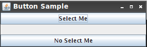
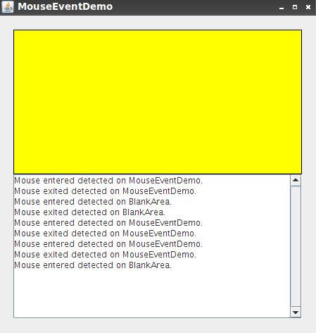

## Pemograman 3 Sesi 05 ##

### Event Handling ###

### Subject : ###

- ActionEvent
- MouseEvent

### Tugas 1 : Membuat ActionEvent ###

Langkah - Langkah :

* Buat Folder dengan nama `Sesi_05` .
* Masuk kedalam folder `Sesi_05` dan buat file baru dengan nama `ActionEventDemo.java` .
* Ketikkan `Source Code` dibawah ini pada file `ActionEventDemo.java` lalu save. 

``` java
import java.awt.BorderLayout;
import java.awt.Color;
import java.awt.event.ActionEvent;
import java.awt.event.ActionListener;
import java.beans.PropertyChangeEvent;
import java.beans.PropertyChangeListener;
import java.util.Random;

import javax.swing.JButton;
import javax.swing.JFrame;

public class ActionEventDemo {

  public static void main(String args[]) {
    JFrame frame = new JFrame("Button Sample");
    frame.setDefaultCloseOperation(JFrame.EXIT_ON_CLOSE);
    final JButton button1 = new JButton("Select Me");
    final JButton button2 = new JButton("No Select Me");
    final Random random = new Random();

    ActionListener actionListener = new ActionListener() {
      public void actionPerformed(ActionEvent actionEvent) {
        JButton button = (JButton) actionEvent.getSource();
        int red = random.nextInt(255);
        int green = random.nextInt(255);
        int blue = random.nextInt(255);
        button.setBackground(new Color(red, green, blue));
      }
    };

    PropertyChangeListener propertyChangeListener = new PropertyChangeListener() {
      public void propertyChange(PropertyChangeEvent propertyChangeEvent) {
        String property = propertyChangeEvent.getPropertyName();
        if ("background".equals(property)) {
          button2.setBackground((Color) propertyChangeEvent.getNewValue());
        }
      }
    };

    button1.addActionListener(actionListener);
    button1.addPropertyChangeListener(propertyChangeListener);
    button2.addActionListener(actionListener);

    frame.add(button1, BorderLayout.NORTH);
    frame.add(button2, BorderLayout.SOUTH);
    frame.setSize(300, 100);
    frame.setVisible(true);
  }

}
```


* Jika sudah kita compile file `ActionEventDemo.java` dengan perintah berikut.

``` 

javac ActionEventDemo.java 

```

* Setelah berhasil compile kita jalankan dengan perintah `java ActionEventDemo` .

* Jika berhasil akan tampil seperti gambar dibawah ini.




### Tugas 2 : Membuat MouseEvent ###

Langkah - Langkah :

* Masih didalam folder `Sesi_05` dan buat file baru dengan nama `BlankArea.java` dan juga `MouseEventDemo.java` .
* Ketikkan `Source Code` dibawah ini pada file `BlankArea.java` lalu save. 

``` java
/*
 * BlankArea.java is used by:
 * MouseEventDemo.java.
 */

import javax.swing.*;
import java.awt.Dimension;
import java.awt.Color;
import java.awt.Graphics;

public class BlankArea extends JLabel {
    Dimension minSize = new Dimension(100, 50);

    public BlankArea(Color color) {
        setBackground(color);
        setOpaque(true);
        setBorder(BorderFactory.createLineBorder(Color.black));
    }

    public Dimension getMinimumSize() {
        return minSize;
    }

    public Dimension getPreferredSize() {
        return minSize;
    }
}
```

* Kemudian ketikkan pula `Source Code` dibawah ini pada `MouseEventDemo.java` yang dibuat tadi, lalu save.

``` java
/*
* MouseEventDemo.java
*/

import java.awt.GridLayout;
import java.awt.Color;
import java.awt.Dimension;
import java.awt.event.MouseListener;
import java.awt.event.MouseEvent;

import javax.swing.*;

public class MouseEventDemo extends JPanel
        implements MouseListener {
    BlankArea blankArea;
    JTextArea textArea;
    static final String NEWLINE = System.getProperty("line.separator");
    
    public static void main(String[] args) {
        /* Use an appropriate Look and Feel */
        try {
            //UIManager.setLookAndFeel("com.sun.java.swing.plaf.windows.WindowsLookAndFeel");
            //UIManager.setLookAndFeel("com.sun.java.swing.plaf.gtk.GTKLookAndFeel");
            UIManager.setLookAndFeel("javax.swing.plaf.metal.MetalLookAndFeel");
        } catch (UnsupportedLookAndFeelException ex) {
            ex.printStackTrace();
        } catch (IllegalAccessException ex) {
            ex.printStackTrace();
        } catch (InstantiationException ex) {
            ex.printStackTrace();
        } catch (ClassNotFoundException ex) {
            ex.printStackTrace();
        }
        /* Turn off metal's use of bold fonts */
        UIManager.put("swing.boldMetal", Boolean.FALSE);
        //Schedule a job for the event dispatch thread:
        //creating and showing this application's GUI.
        javax.swing.SwingUtilities.invokeLater(new Runnable() {
            public void run() {
                createAndShowGUI();
            }
        });
    }
    
    /**
     * Create the GUI and show it.  For thread safety,
     * this method should be invoked from the
     * event dispatch thread.
     */
    private static void createAndShowGUI() {
        //Create and set up the window.
        JFrame frame = new JFrame("MouseEventDemo");
        frame.setDefaultCloseOperation(JFrame.EXIT_ON_CLOSE);
        
        //Create and set up the content pane.
        JComponent newContentPane = new MouseEventDemo();
        newContentPane.setOpaque(true); //content panes must be opaque
        frame.setContentPane(newContentPane);
        
        //Display the window.
        frame.pack();
        frame.setVisible(true);
    }
    
    public MouseEventDemo() {
        super(new GridLayout(0,1));
        blankArea = new BlankArea(Color.YELLOW);
        add(blankArea);
        textArea = new JTextArea();
        textArea.setEditable(false);
        JScrollPane scrollPane = new JScrollPane(textArea);
        scrollPane.setVerticalScrollBarPolicy(
                JScrollPane.VERTICAL_SCROLLBAR_ALWAYS);
        scrollPane.setPreferredSize(new Dimension(200, 75));
        add(scrollPane);
        
        //Register for mouse events on blankArea and the panel.
        blankArea.addMouseListener(this);
        addMouseListener(this);
        setPreferredSize(new Dimension(450, 450));
        setBorder(BorderFactory.createEmptyBorder(20,20,20,20));
    }
    
    void eventOutput(String eventDescription, MouseEvent e) {
        textArea.append(eventDescription + " detected on "
                + e.getComponent().getClass().getName()
                + "." + NEWLINE);
        textArea.setCaretPosition(textArea.getDocument().getLength());
    }
    
    public void mousePressed(MouseEvent e) {
        eventOutput("Mouse pressed (# of clicks: "
                + e.getClickCount() + ")", e);
    }
    
    public void mouseReleased(MouseEvent e) {
        eventOutput("Mouse released (# of clicks: "
                + e.getClickCount() + ")", e);
    }
    
    public void mouseEntered(MouseEvent e) {
        eventOutput("Mouse entered", e);
    }
    
    public void mouseExited(MouseEvent e) {
        eventOutput("Mouse exited", e);
    }
    
    public void mouseClicked(MouseEvent e) {
        eventOutput("Mouse clicked (# of clicks: "
                + e.getClickCount() + ")", e);
    }
}
```

* Jika sudah kita cukup compile file `MouseEventDemo.java` -nya saja, dengan perintah berikut.

``` 
javac TextFieldDemo.java 
```

* Setelah berhasil compile kita jalankan dengan perintah `java MouseEventDemo` .

* Jika berhasil akan tampil seperti gambar dibawah ini.


