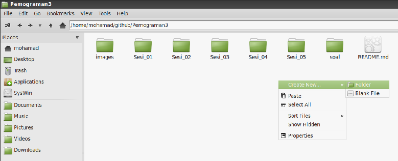
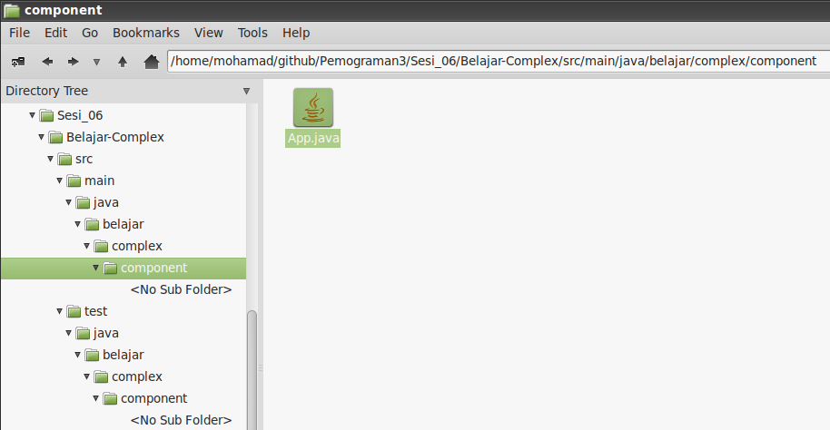
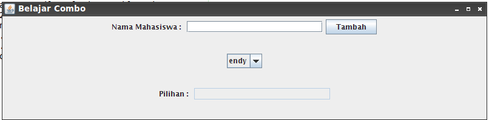
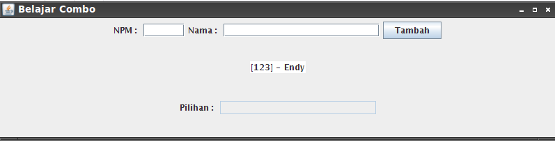

## Pemograman 3 Sesi 06 ##

### Complex Component ###

### Subject : ###

- ComboBox/Select
- List

### Tugas 1 : Membuat ComboBox/Select ###

Langkah - Langkah :

1. Buat Folder dengan nama `Sesi_06` seperti gambar berikut.



2. Buka `Command Prompt` lalu masuk kedalam folder `Sesi_06` dengan perintah `cd Sesi_06` .

3. Ketikkan `mvn archetype:create -DgroupId=belajar.complex.component -DartifactId=Belajar-Complex` ,
jika tidak ada masalah maka akan terbuat struktur folder project maven dengan nama Belajar-Complex seperti gambar dibawah .



4. Setelah berhasil dibuat maka kita dapat membuat file baru pada folder `Belajar-Complex/src/main/java/belajar/complex/component`
dengan nama `DemoCombo.java` .

5. Lalu ketikkan `Source Code` dibawah ini :

``` java
package belajar.complex.component;

import javax.swing.*;
import java.awt.FlowLayout;
import java.awt.GridLayout;
import java.awt.event.*;
import java.util.List;
import java.util.ArrayList;

public class DemoCombo {
    private static JComboBox cmbMahasiswa = new JComboBox();
    private static final List<String> daftarMahasiswa 
        = new ArrayList<String>();

    public static void isiCombo(){
        // data dimasukkan ke dalam class model
        DefaultComboBoxModel model 
            = new DefaultComboBoxModel(daftarMahasiswa.toArray());
        
        // pasang model di combo
        cmbMahasiswa.setModel(model);
    }
    
    public static void tambahIsiCombo(String data){
        // data untuk ditampilkan dalam combo
        daftarMahasiswa.add(data);
        isiCombo();
    }

    public static void main(String[] xx){
        tambahIsiCombo("endy");
                
        JLabel lbl = new JLabel("Nama Mahasiswa : ");
        final JTextField tfMahasiswa = new JTextField(20);
        JButton btnTambah = new JButton("Tambah");
        
        JPanel panel = new JPanel();
        panel.setLayout(new FlowLayout());
        panel.add(lbl);
        panel.add(tfMahasiswa);
        panel.add(btnTambah);
        
        JPanel panel2 = new JPanel();
        panel2.setLayout(new FlowLayout());
        
        panel2.add(cmbMahasiswa);
        
        JPanel panel4 = new JPanel(new FlowLayout());
        panel4.add(new JLabel("Pilihan : "));
        final JTextField tfPilihan = new JTextField(20);
        tfPilihan.setEditable(false);
        panel4.add(tfPilihan);
        
        JPanel panel3 = new JPanel();
        panel3.setLayout(new GridLayout(3,1));
        
        panel3.add(panel);
        panel3.add(panel2);
        panel3.add(panel4);
        
        // menginstankan Frame
        JFrame fr = new JFrame("Belajar Combo");
        
        fr.getContentPane().add(panel3);
        // ukuran frame
        fr.setSize(800,200);
        
        // posisi di tengah
        fr.setLocationRelativeTo(null);
        
        // tampilkan
        fr.setVisible(true);
        
        // event handler untuk button
        class TambahMahasiswaListener implements ActionListener{
            public void actionPerformed(ActionEvent e){
                String data = tfMahasiswa.getText();
                System.out.println("Isi textfield : "+data);
                
                // tambahkan isinya ke dalam combo
                tambahIsiCombo(data);
                
                // kosongkan textfield
                tfMahasiswa.setText("");
                tfMahasiswa.requestFocus();
            }
        }
        
        // pasang event handler di button dan textfield
        TambahMahasiswaListener l = new TambahMahasiswaListener();
        btnTambah.addActionListener(l);
        tfMahasiswa.addActionListener(l);
        
        // event handler untuk combo
        class PilihanComboListener implements ActionListener {
            public void actionPerformed(ActionEvent e){
                JComboBox cb = (JComboBox) e.getSource();
                String pilihan = (String) cb.getSelectedItem();
                tfPilihan.setText(pilihan);
            }
        }
        
        // pasang listener di combo
        cmbMahasiswa.addActionListener(new PilihanComboListener());
    }
}
```

6. Jika sudah compile dengan perintah `mvn clean package exec:java -Dexec.mainClass=belajar.complex.component.DemoCombo` ,
jika terjadi error maka tambahkan baris `Source Code` dibawah ini pada `pom.xml` tepat dibawah tutup `</dependencies>` :

``` xml
  <build>
		<plugins>
			<plugin>
				<groupId>org.apache.maven.plugins</groupId>
				<artifactId>maven-compiler-plugin</artifactId>
				<version>2.0.2</version>
				<configuration>
					<source>1.6</source>
					<target>1.6</target>
				</configuration>
			</plugin>
		</plugins>
	</build>
```

7. Jika sudah compile kembali dengan perintah pada nomor 6, jika berhasil akan tampil sebagai berikut :




### Tugas 2 : Membuat List ###

Langkah - Langkah :

1. Buat file baru pada `Belajar-Complex/src/main/java/belajar/complex/component` , berinama `Mahasiswa.java`.

2. Kemudian ketikkan `Source Code` dibawah ini pada file yang dibuat tadi.

``` java
package belajar.complex.component;

public class Mahasiswa{
    private String npm;
    private String nama;
    
    public String getNpm(){
        return this.npm;
    }
    
    public void setNpm(String x){
        this.npm = x;
    }
    
    public String getNama(){
        return this.nama;
    }
    
    public void setNama(String x){
        this.nama = x;
    }
    
    public String toString(){
        return "["+this.npm+"] - " + this.nama;
    }
}
```

3. Jika sudah kembali buat file baru dengan nama `DemoListMahasiswa.java` dan ketikkan
`Source Code` dibawah ini :

``` java
package belajar.complex.component;

import javax.swing.*;
import javax.swing.event.ListSelectionEvent;
import javax.swing.event.ListSelectionListener;
import java.awt.FlowLayout;
import java.awt.GridLayout;
import java.awt.event.*;
import java.util.List;
import java.util.ArrayList;

public class DemoListMahasiswa {
    private static JList listMahasiswa = new JList();
    private static final List<Mahasiswa> daftarMahasiswa 
        = new ArrayList<Mahasiswa>();

    public static void isiCombo(){
        // data dimasukkan ke dalam class model
        DefaultComboBoxModel model 
            = new DefaultComboBoxModel(daftarMahasiswa.toArray());
        
        // pasang model di combo
        listMahasiswa.setModel(model);
    }
    
    public static void tambahIsiList(Mahasiswa data){
        // data untuk ditampilkan dalam combo
        daftarMahasiswa.add(data);
        isiCombo();
    }

    public static void main(String[] xx){
        Mahasiswa m = new Mahasiswa();
        m.setNpm("123");
        m.setNama("Endy");
        tambahIsiList(m);
        
        final JTextField tfNpm = new JTextField(5);
        final JTextField tfNama = new JTextField(20);
        JButton btnTambah = new JButton("Tambah");
        
        JPanel panel = new JPanel();
        panel.setLayout(new FlowLayout());
        panel.add(new JLabel("NPM : "));
        panel.add(tfNpm);
        panel.add(new JLabel("Nama : "));
        panel.add(tfNama);
        panel.add(btnTambah);
        
        JPanel panel2 = new JPanel();
        panel2.setLayout(new FlowLayout());
        
        panel2.add(listMahasiswa);
        
        JPanel panel4 = new JPanel(new FlowLayout());
        panel4.add(new JLabel("Pilihan : "));
        final JTextField tfPilihan = new JTextField(20);
        tfPilihan.setEditable(false);
        panel4.add(tfPilihan);
        
        JPanel panel3 = new JPanel();
        panel3.setLayout(new GridLayout(3,1));
        
        panel3.add(panel);
        panel3.add(panel2);
        panel3.add(panel4);
        
        // menginstankan Frame
        JFrame fr = new JFrame("Belajar Combo");
        
        fr.getContentPane().add(panel3);
        // ukuran frame
        fr.setSize(800,200);
        
        // posisi di tengah
        fr.setLocationRelativeTo(null);
        
        // tampilkan
        fr.setVisible(true);
        
        // event handler untuk button
        class TambahMahasiswaListener implements ActionListener{
            public void actionPerformed(ActionEvent e){
                String npm = tfNpm.getText();
                String nama = tfNama.getText();
                System.out.println("NPM : "+npm);
                System.out.println("Nama : "+nama);
                
                // tambahkan isinya ke dalam combo
                Mahasiswa x = new Mahasiswa();
                x.setNpm(npm);
                x.setNama(nama);
                tambahIsiList(x);
                
                // kosongkan textfield
                tfNama.setText("");
                tfNpm.setText("");
                tfNpm.requestFocus();
            }
        }
        
        // pasang event handler di button dan textfield
        TambahMahasiswaListener l = new TambahMahasiswaListener();
        btnTambah.addActionListener(l);
        
        // event handler untuk combo
        class PilihanListListener implements  ListSelectionListener {
            public void valueChanged(ListSelectionEvent e){
                JList l = (JList) e.getSource();
                int indexPilihan = l.getSelectedIndex();
                System.out.println("Pilihan : "+indexPilihan);
                
                if(indexPilihan < 0){
                    return; // tidak ada yang dipilih, lanjut saja
                }
                
                Mahasiswa x = daftarMahasiswa.get(indexPilihan);
                tfPilihan
                    .setText(x.getNpm() + " - "+x.getNama());
            }
        }
        
        // pasang listener di combo
        listMahasiswa.addListSelectionListener(new PilihanListListener());
    }
}
```

4. Apa bila telah selesai kita dapat mengcompilenya dengan perintah berikut :

```
mvn clean package exec:java -Dexec.mainClass=belajar.complex.component.DemoListMahasiswa
```

5. Jika tidak ada masalah maka akan tampil seperti screenshot berikut :



