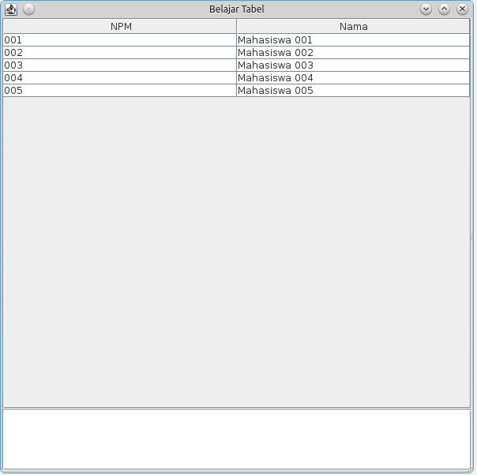

## Pemograman 3 Sesi 07 ##

### Swing Table ###

### Subject : ###

- JTable
- TableModel 

### Tugas : Membuat JTable ###

Langkah - Langkah :


1. Buat Folder dengan nama `Sesi_07` 

2. Buka `Command Prompt` lalu masuk kedalam folder `Sesi_07` dengan perintah `cd Sesi_07`.

3. Ketikkan `mvn archetype:create -DgroupId=project.belajar.jtable -DartifactId=Belajar-Tabel` ,
jika tidak ada masalah maka akan terbuat struktur folder project maven dengan nama `Belajar-Tabel`.

4. Setelah berhasil dibuat kemudian kita buat class Mahasiswa pada folder `Belajar-Tabel/src/main/java/project/belajar/jtable/`.

5. Lalu ketikkan `Source Code` dibawah ini pada class Mahasiswa.

``` java
package project.belajar.jtable;

public class Mahasiswa{
    private String npm;
    private String nama;
    
    public String getNpm(){
        return this.npm;
    }
    
    public void setNpm(String x){
        this.npm = x;
    }
    
    public String getNama(){
        return this.nama;
    }
    
    public void setNama(String x){
        this.nama = x;
    }
    
    public String toString(){
        return "["+this.npm+"] - " + this.nama;
    }
}
```

6. Kemudian buat satu buah class lagi yang akan meng'extends `AbstractTableModel` ,
dan isikan `Source Code` dibawah ini pada class tersebut.

``` java
package project.belajar.jtable;

import javax.swing.table.AbstractTableModel;

import java.util.List;
import java.util.ArrayList;

public class MahasiswaTableModel extends AbstractTableModel{
    private String[] namaKolom 
    = new String[]{"NPM", "Nama"};
    
    private List<Mahasiswa> dataMahasiswa = new ArrayList<Mahasiswa>();
    
    public MahasiswaTableModel(List<Mahasiswa> data){
        this.dataMahasiswa = data;
    }
    
    public String getColumnName(int col) {
        return namaKolom[col].toString();
    }
    public int getRowCount() { return dataMahasiswa.size(); }
    public int getColumnCount() { return namaKolom.length; }
    public Object getValueAt(int baris, int kolom) {
        Mahasiswa m = dataMahasiswa.get(baris);
        
        switch(kolom){
            case 0: return m.getNpm();
            case 1: return m.getNama();
            default: return null;
        }
    }
    
    public boolean isCellEditable(int row, int col){ return true; }
    public void setValueAt(Object value, int baris, int kolom) {
        Mahasiswa m = dataMahasiswa.get(baris);
        String isi = (String) value;
        
        switch(kolom){
            case 0: m.setNpm(isi); break;
            case 1: m.setNama(isi); break;
            default: break;
        }
        fireTableCellUpdated(baris, kolom);
    }
}
```

7. Langkah terakhir adalah membuat `main class` untuk menjalankan class-class yang terlah dibaut tadi.
Beri nama `DemoTabel` pada `main class` lalu ketikkan `Source Code` dibawah ini. 

``` java
package project.belajar.jtable;

import javax.swing.*;
import java.awt.*;
import java.util.List;
import java.util.ArrayList;

import javax.swing.event.*;
import javax.swing.table.*;

public class DemoTabel{
    private static final JTable tabel = new JTable();
    private static final List<Mahasiswa> data = sampleData();

    public static void main(String[] xx){
        JFrame fr = new JFrame("Belajar Tabel");
        
        MahasiswaTableModel model 
            = new MahasiswaTableModel(data);
        model.addTableModelListener(new TabelDiubahListener());
        tabel.setModel(model);
        
        tabel.setSelectionMode(ListSelectionModel.SINGLE_SELECTION);
        tabel.getSelectionModel()
            .addListSelectionListener(new TabelDipilihListener());
        
        JScrollPane scrTabel = new JScrollPane(tabel);
        
        
        JTextArea txtOutput = new JTextArea(5,20);
        JScrollPane scrText = new JScrollPane(txtOutput);
        
        fr.getContentPane().add(scrText, BorderLayout.SOUTH);
        fr.getContentPane().add(scrTabel, BorderLayout.CENTER);
        
        fr.setSize(600,600);
        fr.setLocationRelativeTo(null);
        fr.setDefaultCloseOperation(JFrame.EXIT_ON_CLOSE);
        fr.setVisible(true);
    }
    
    private static class TabelDipilihListener
         implements ListSelectionListener{
        public void valueChanged(ListSelectionEvent e){
            
            int baris = tabel.getSelectedRow();
            System.out.println("Baris "+baris+" dipilih");
            
            if(baris > -1) {
                Mahasiswa x = data.get(baris);
                System.out.println("NPM : "+x.getNpm());
            }
        }
    }
    
    private static class TabelDiubahListener 
        implements TableModelListener{
        
        public void tableChanged(TableModelEvent e) {
            int baris = e.getFirstRow();
            int kolom = e.getColumn();
            System.out.print("Terjadi perubahan di ");
            System.out.print("baris "+baris);
            System.out.println(" kolom "+kolom);
            TableModel model = (TableModel)e.getSource();
            Object data = model.getValueAt(baris,kolom);
            System.out.println("Data baru : "+data);
        } 
    }
    
    private static List<Mahasiswa> sampleData(){
        List<Mahasiswa> data = new ArrayList<Mahasiswa>();
        
        Mahasiswa m1 = new Mahasiswa();
        m1.setNpm("001");
        m1.setNama("Mahasiswa 001");
        data.add(m1);
        
        Mahasiswa m2 = new Mahasiswa();
        m2.setNpm("002");
        m2.setNama("Mahasiswa 002");
        data.add(m2);
        
        Mahasiswa m3 = new Mahasiswa();
        m3.setNpm("003");
        m3.setNama("Mahasiswa 003");
        data.add(m3);
        
        Mahasiswa m4 = new Mahasiswa();
        m4.setNpm("004");
        m4.setNama("Mahasiswa 004");
        data.add(m4);
        
        Mahasiswa m5 = new Mahasiswa();
        m5.setNpm("005");
        m5.setNama("Mahasiswa 005");
        data.add(m5);
        
        return data;
        
    }
}
```

8. Jangan lupa sebelum mengcompile tambahkan plugin xml dibawah ini pada pom.xml tepat dibawah baris `</dependencies>` lalu compile dengan perintah `mvn clean package exec:java -Dexec.mainClass=project.belajar.jtable.DemoTabel` ,
jika tidak terjadi error maka akan tampil seperti screenshot dibawah ini.

``` xml
<build>
	<plugins>
		<plugin>
			<groupId>org.apache.maven.plugins</groupId>
			<artifactId>maven-compiler-plugin</artifactId>
			<version>2.0.2</version>
			<configuration>
				<source>1.6</source>
				<target>1.6</target>
			</configuration>
		</plugin>
	</plugins>
</build>
```


