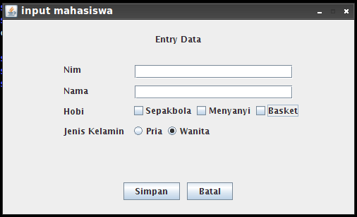
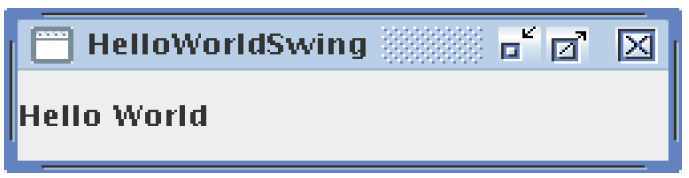

1 . Layout Manager apa saja yang diperlukan jika ingin membuat aplikasi seperti gambar berikut dan berikan contoh penggunaanya :


2. Berikanlah penjelasan fungsi kode pada baris komentar yang telah diberi nomor dibawah ini :

``` java
public class TugasFrame {
    public static void main(String[] xx){
    
        // 0. ........................
        JFrame fr = new JFrame("Demo Program");
        
        // 1. ........................
        fr.setSize(400,400);
        
        // 2. ........................
        JPanel pnlKiri = new JPanel(new BorderLayout());
        JPanel pnlKanan = new JPanel();
        
        // 3 ........................
        TitledBorder brdKiri = 
            BorderFactory.createTitledBorder("Panel Kiri");
        TitledBorder brdKanan = 
            BorderFactory.createTitledBorder("Panel Kanan");
        
        pnlKiri.setBorder(brdKiri);
        pnlKanan.setBorder(brdKanan);
        
        JSplitPane split = new JSplitPane(
            JSplitPane.HORIZONTAL_SPLIT,
            pnlKiri,
            pnlKanan
        );
        split.setDividerLocation(150);
        fr.getContentPane().add(split);
        
        // 4. ........................
        DefaultMutableTreeNode root =
            new DefaultMutableTreeNode("Pemrograman 3");
        
        DefaultMutableTreeNode sesi01 =
            new DefaultMutableTreeNode("Sesi 01");
        
        DefaultMutableTreeNode sesi0101 =
            new DefaultMutableTreeNode("Setup Project");
        
        DefaultMutableTreeNode sesi0102 =
            new DefaultMutableTreeNode("Memahami Frame");
        
        DefaultMutableTreeNode sesi02 =
            new DefaultMutableTreeNode("Sesi 02");
            
        // 5 ........................
        root.add(sesi01);
        sesi01.add(sesi0101);
        sesi01.add(sesi0102);
        root.add(sesi02);
        
        JTree tree = new JTree(root);
        JScrollPane scrTree = new JScrollPane(tree);
        pnlKiri.add(scrTree);
        
        // 6. ........................
        fr.setLocationRelativeTo(null);
        fr.setVisible(true);
    }
} 
```

3. Pada soal nomor 2, terdapat `library-library` yang perlu di `import` sebutkan satu persatu dan berikan penjelasannya!

4. Gambarkan struktur project yang akan terbuat jika menggunakan perintah berikut
`mvn archetype:create -DgroupId=com.project.kampus -DartifactId=pemograman3` pada maven2!

5. Buatlah sebauh aplikasi seperti gambar berikut!

