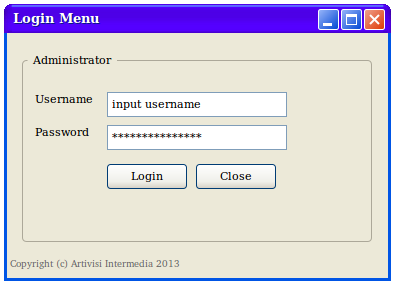

## Soal Ujian Pemograman 3 ##

### Waktu Pengerjaan : ###
- 60 menit

### Sifat : ###

- Open Book
- Open PC/Laptop

### Soal ###

1. Lengkapilah kekurangan `SourceCode` dibawah ini dengan asumsi memiliki 
file gambar dengan nama `Bird.gif`, `Cat.gif`, `Dog.gif`, `Rabbit.gif`, `Pig.gif` 
yang diletakkan pada folder `images` posisi sejajar dengan class `CustomComboBoxDemo.java` !

``` java
public class CustomComboBoxDemo extends JPanel {

    ImageIcon[] images;
    String[] petStrings = {"Bird", "Cat", "Dog", "Rabbit", "Pig"};

    public CustomComboBoxDemo() {
        super(new BorderLayout());

        images = new ImageIcon[petStrings.length];
        Integer[] intArray = new Integer[petStrings.length];
        
      1. ...................................................  
      
            intArray[i] = new Integer(i);
            images[i] = createImageIcon("images/" + petStrings[i] + ".gif");
            if (images[i] != null) {
                images[i].setDescription(petStrings[i]);
            }
        }
        

      2. ...................................................  
      
        ComboBoxRenderer renderer = new ComboBoxRenderer();
        renderer.setPreferredSize(new Dimension(200, 130));
        petList.setRenderer(renderer);
        petList.setMaximumRowCount(3);

        add(petList, BorderLayout.PAGE_START);
        setBorder(BorderFactory.createEmptyBorder(20, 20, 20, 20));
    }

    protected static ImageIcon createImageIcon(String path) {
        java.net.URL imgURL = CustomComboBoxDemo.class.getResource(path);
        if (imgURL != null) {
            return new ImageIcon(imgURL);
        } else {
            System.err.println("Couldn't find file: " + path);
            return null;
        }
    }

    private static void createAndShowGUI() {


      3. ...................................................  
      
        frame.setDefaultCloseOperation(JFrame.EXIT_ON_CLOSE);

        JComponent newContentPane = new CustomComboBoxDemo();
        newContentPane.setOpaque(true); 
        frame.setContentPane(newContentPane);

        frame.pack();
        frame.setVisible(true);
    }


      4. ...................................................  
      
        javax.swing.SwingUtilities.invokeLater(new Runnable() {
            public void run() {
                createAndShowGUI();
            }
        });
    }


      5. ...................................................  
      

        private Font uhOhFont;

        public ComboBoxRenderer() {
            setOpaque(true);
            setHorizontalAlignment(CENTER);
            setVerticalAlignment(CENTER);
        }

        public Component getListCellRendererComponent(
                JList list,
                Object value,
                int index,
                boolean isSelected,
                boolean cellHasFocus) {

            int selectedIndex = ((Integer) value).intValue();

            if (isSelected) {
                setBackground(list.getSelectionBackground());
                setForeground(list.getSelectionForeground());
            } else {
                setBackground(list.getBackground());
                setForeground(list.getForeground());
            }

            ImageIcon icon = images[selectedIndex];
            String pet = petStrings[selectedIndex];
            setIcon(icon);
            if (icon != null) {
                setText(pet);
                setFont(list.getFont());
            } else {
                setUhOhText(pet + " (no image available)",
                        list.getFont());
            }

            return this;
        }

        protected void setUhOhText(String uhOhText, Font normalFont) {
            if (uhOhFont == null) { 
                uhOhFont = normalFont.deriveFont(Font.ITALIC);
            }
            setFont(uhOhFont);
            setText(uhOhText);
        }
    }
}
```

2. Buatlah form login seperti gambar dibawah yang menggunakan validasi database dengan action ke-form lain jika berhasil login!
Uraikan sourcecode class login yang dibuat pada lembar jawaban lalu push ke-GitHub.com.


